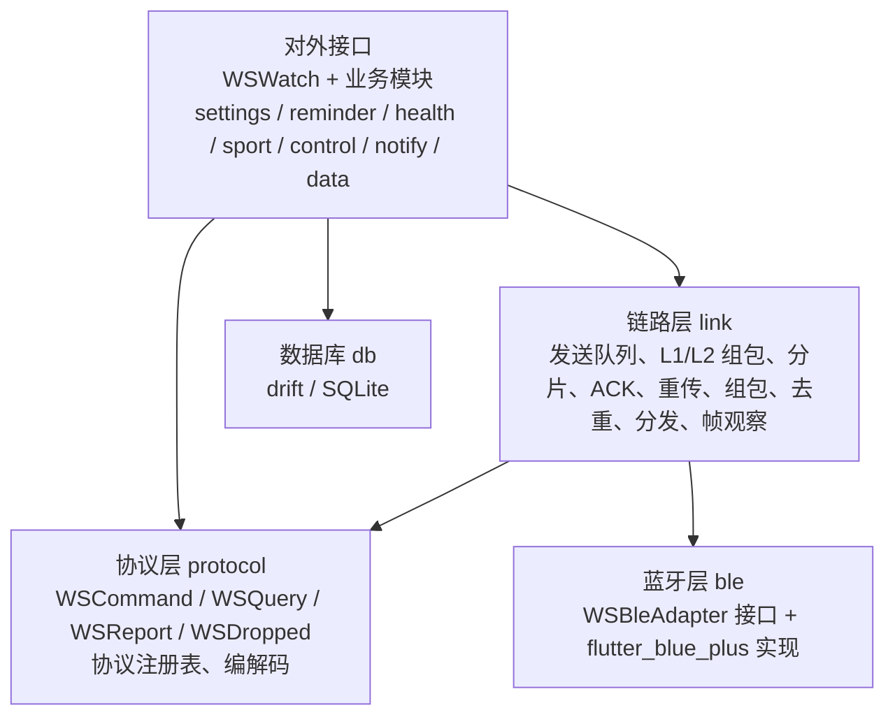
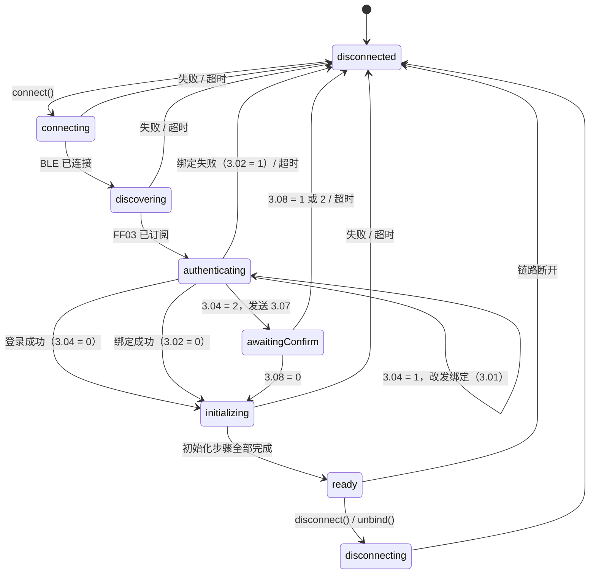
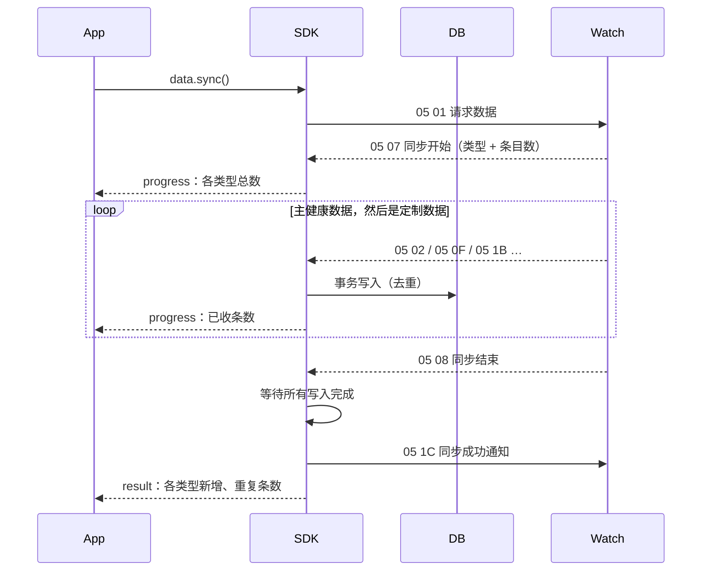

# WS Watch SDK 与 Demo 设计文档

> 状态：草案，待评审
> 范围：WS（wo-smart）手表 BLE SDK 的 Flutter 实现（`ws_watch_sdk`）及其 Demo（`ws_watch_demo`），第一阶段在 HoneyBox 仓库内开发、与手表固件联调
> 协议依据：`Cavo-Ble-SourceCode-Android/UkProtocolLibary/docs/HL_Private_Protocol.md`（下文简称"协议文档"，章节号如"2.4E"均指该文档）
> 参考实现：Java SDK v2（`ukprotocollibary/v2`），以及 HoneyBox 现有 JW 模块（`lib/services/jw/`）

---

## 目录

1. [背景与目标](#1-背景与目标)
2. [总体架构](#2-总体架构)
3. [目录与文件清单](#3-目录与文件清单)
4. [蓝牙层 ble](#4-蓝牙层-ble)
5. [链路层 link](#5-链路层-link)
6. [协议层 protocol](#6-协议层-protocol)
7. [连接状态机](#7-连接状态机)
8. [设备能力](#8-设备能力)
9. [对外接口](#9-对外接口)
10. [数据同步](#10-数据同步)
11. [数据库](#11-数据库)
12. [错误与日志](#12-错误与日志)
13. [Demo 设计](#13-demo-设计)
14. [HoneyBox 集成](#14-honeybox-集成)
15. [测试策略](#15-测试策略)
16. [参考 HoneyBox JW 模块](#16-参考-honeybox-jw-模块)
17. [第一阶段里程碑](#17-第一阶段里程碑)
18. [待确认事项](#18-待确认事项)
19. [附录 A：v2 与 WS 接口对照（第一阶段）](#附录-av2-与-ws-接口对照第一阶段)
20. [附录 B：命名与代码约定](#附录-b命名与代码约定)

---

## 1. 背景与目标

### 1.1 背景

- 现有 Java SDK 同时存在 v1（`WristbandManager`）和 v2（`JWManager`）两套接口，历史协议多，很多功能已不再使用，也没有设备可调试。
- 协议要精简：部分协议丢弃，但编号必须保留占位，不能复用。
- 需要一个 Flutter SDK 作为基础 SDK 方案，将来可对外提供；Flutter 实现同时作为其它平台（Kotlin、Swift 等）SDK 的参考。
- 当前处于初级阶段，需要和手表固件一起联调。

### 1.2 目标

- 一个 SDK 工程（`ws_watch_sdk`）和一个 SDK Demo 工程（`ws_watch_demo`），边界清晰，将来可整体从 HoneyBox 独立出去。
- 分层清楚：业务接口 → 协议定义 → 链路（组包、ACK、重传） → 系统蓝牙。只有蓝牙层对接 Flutter 蓝牙插件。
- 一条协议只在一处定义；丢弃的协议保留占位。
- 连接、登录、初始化由明确的状态机管理。
- SDK 内置数据库存储健康数据。
- 联调友好：收发的每一帧都可观察，可以发送任意原始命令。

### 1.3 第一阶段不做

- 工厂测试（0x06）、客户定制（0x58）、多命令（0x08）、FF0A 特征值、涂鸦相关协议：后续再讨论保留范围。
- 提醒、健康测量、运动、控制、通知模块：第一阶段只搭好模块位置，协议在架子跑通后逐个补齐。
- OTA、表盘传输。

---

## 2. 总体架构

### 2.1 工程结构

```text
HoneyBox/
├── packages/
│   ├── ws_watch_sdk/        SDK 工程（Flutter package）
│   └── ws_watch_demo/       SDK Demo 工程（Flutter package，手表相关全部界面）
└── lib/                     HoneyBox App，只负责挂载 ws_watch_demo 的入口页面
```

- `ws_watch_demo` 只依赖 `ws_watch_sdk`，不引用 HoneyBox 的任何代码。
- HoneyBox 通过 `path` 依赖引用两个包。

### 2.2 SDK 分层



依赖规则：

| 层 | 可以依赖 | 不能依赖 |
| --- | --- | --- |
| 对外接口（`watch.dart`、`features/`） | protocol、link、db、model | ble 的具体实现 |
| 协议层 `protocol/` | model | 其它任何层 |
| 链路层 `link/` | protocol（只用注册表做分发和命名）、ble 接口 | features、db |
| 蓝牙层 `ble/` | flutter_blue_plus | 其它任何层 |
| 数据库 `db/` | drift、model | protocol、link、ble |

### 2.3 一次调用经过的路径

设置时间：

```text
watch.settings.setTime(dt)
  → 状态检查（必须就绪）、能力检查
  → link.send(WSSettingsProtocol.setTime, dt)
      → setTime.encode(dt)                  4 字节时间位域
      → L2：[0x02, 0x00, 0x01, 0x00, 0x04, …4 字节]
      → L1：加 8 字节头（magic、flags、长度、CRC16、seq）
      → 按 MTU 分片，逐片写入 FF02，等待设备 ACK
  → Future 完成
```

读语言：

```text
watch.settings.getLanguage()
  → link.query(WSSettingsProtocol.getLanguage)
      → 发送 02 00 4F 00 00，等待 ACK
      → 等待回包 (0x02, 0x50)
      → getLanguage.decode(bytes) → WSLanguage
  → Future<WSLanguage> 完成
```

设备主动上报（如实时心率、同步数据）：

```text
FF03 通知 → link 组包、校验、回 ACK、去重
  → 协议注册表找到 WSReport
  → report.decode(bytes)
  → 对应模块的 Stream / 同步流程
```

---

## 3. 目录与文件清单

### 3.1 ws_watch_sdk

```text
packages/ws_watch_sdk/
├── pubspec.yaml
├── analysis_options.yaml
├── build.yaml                         drift 代码生成配置
├── lib/
│   ├── ws_watch_sdk.dart              对外导出（只导出公开 API）
│   └── src/
│       ├── watch.dart                 WSWatch：入口，持有各模块、link、db、状态机
│       ├── config.dart                WSConfig：超时、重试、数据库位置、日志
│       ├── scanner.dart               WSScanner：扫描（基于 WSBleAdapter）
│       ├── connection/
│       │   ├── connection_machine.dart    连接状态机
│       │   ├── connection_state.dart      WSConnectionState、WSConnectionStage
│       │   └── user_id.dart               WSUserId：32 字节用户 ID 生成与校验
│       ├── capability/
│       │   ├── feature.dart               WSFeature 枚举（对应 2.37 的 64 个 bit）
│       │   └── capabilities.dart          WSCapabilities：解析与查询
│       ├── features/                      业务模块
│       │   ├── settings.dart              WSSettings
│       │   ├── reminder.dart              WSReminder（第一阶段只建空模块）
│       │   ├── health.dart                WSHealth（同上）
│       │   ├── sport.dart                 WSSport（同上）
│       │   ├── control.dart               WSControl（同上）
│       │   ├── notify.dart                WSNotify（同上）
│       │   └── data/
│       │       ├── data.dart              WSData：同步入口、查询入口
│       │       ├── sync_session.dart      一次同步的流程控制
│       │       └── record_query.dart      WSRecordQuery、各类数据查询器
│       ├── protocol/
│       │   ├── protocol.dart              WSProtocolEntry 基类、WSCommand / WSQuery / WSReport / WSDropped
│       │   ├── registry.dart              WSProtocolRegistry：汇总全部条目、冲突校验、按 (cmd, key) 查找
│       │   ├── status.dart                WSProtocolStatus
│       │   ├── cmd_02_settings.dart       第 2 章
│       │   ├── cmd_03_bind.dart           第 3 章
│       │   ├── cmd_04_notify.dart         第 4 章（第一阶段只放占位）
│       │   ├── cmd_05_health.dart         第 5 章
│       │   ├── cmd_07_control.dart        第 7 章（第一阶段只放占位）
│       │   └── codec/
│       │       ├── bits.dart              按位读写工具（大端）
│       │       ├── date_time_codec.dart   2.01 时间位域、数据头日期位域
│       │       ├── step_codec.dart        5.02 运动数据解析
│       │       └── heart_rate_codec.dart  5.0F / 5.1B 心率解析
│       ├── link/
│       │   ├── link.dart                  WSLink：发送队列、ACK、重传、回包匹配、分发
│       │   ├── frame.dart                 L1 帧编解码、CRC16
│       │   ├── frame_assembler.dart       接收组包（跨多个通知）
│       │   ├── message.dart               L2 包编解码
│       │   └── frame_log.dart             WSFrameEvent：帧观察事件
│       ├── ble/
│       │   ├── ble_adapter.dart           WSBleAdapter 抽象接口、WSBleDevice、WSAdvertisement
│       │   ├── gatt_profile.dart          服务和特征值 UUID
│       │   └── flutter_blue_adapter.dart  基于 flutter_blue_plus 的实现
│       ├── db/
│       │   ├── database.dart              drift 数据库定义、版本与迁移
│       │   ├── tables.dart                表定义
│       │   ├── device_dao.dart
│       │   ├── step_dao.dart
│       │   ├── heart_rate_dao.dart
│       │   └── sync_log_dao.dart
│       ├── model/
│       │   ├── device_info.dart           WSDeviceInfo（2.52）
│       │   ├── language.dart              WSLanguage（2.4E 全部取值）
│       │   ├── units.dart                 WSHourSystem、WSDistanceUnit
│       │   ├── step_record.dart
│       │   ├── heart_rate_record.dart
│       │   ├── sync.dart                  WSSyncProgress、WSSyncResult、WSHistoryType
│       │   └── wall_clock.dart            WSWallClock：设备本地时间
│       ├── errors.dart                    WSException 及子类
│       └── logger.dart                    WSLogger
└── test/
    ├── fakes/
    │   ├── fake_ble_adapter.dart          模拟蓝牙
    │   └── fake_watch_device.dart         模拟手表固件（可脚本化 ACK 丢失、CRC 错误、分片、重复 seq）
    ├── vectors/                           协议测试向量（JSON）
    ├── protocol/
    ├── link/
    ├── connection/
    ├── features/
    └── db/
```

### 3.2 ws_watch_demo

```text
packages/ws_watch_demo/
├── pubspec.yaml
└── lib/
    ├── ws_watch_demo.dart             对外导出：WSWatchDemoApp、WSWatchDemoHome
    └── src/
        ├── demo_app.dart              WSWatchDemoApp（完整 MaterialApp，独立运行时使用）
        ├── demo_home.dart             WSWatchDemoHome（可嵌入宿主 App 的入口页面）
        ├── demo_scope.dart            DemoScope：持有 WSWatch 实例（InheritedWidget）
        ├── run_action.dart            统一执行 SDK 调用并展示结果
        ├── scan/
        │   └── scan_page.dart
        ├── home/
        │   ├── device_home_page.dart
        │   ├── connection_stage_view.dart
        │   └── module_grid.dart
        ├── settings/
        │   └── settings_page.dart
        ├── data/
        │   ├── sync_page.dart
        │   └── records_page.dart
        ├── reminder/  health/  sport/  control/  notify/   第一阶段为占位页
        ├── debug/
        │   ├── debug_panel.dart           悬浮入口
        │   ├── frame_log_page.dart
        │   ├── raw_send_page.dart
        │   ├── protocol_table_page.dart
        │   └── device_reports_page.dart
        └── widgets/
            ├── result_card.dart
            ├── hex_view.dart
            ├── capability_gate.dart
            └── form_fields.dart
```

---

## 4. 蓝牙层 ble

### 4.1 GATT

| 项 | UUID | 用途 |
| --- | --- | --- |
| 服务 | `000001ff-3c17-d293-8e48-14fe2e4da212` | 私有协议服务 |
| 写特征值 | `0000ff02-0000-1000-8000-00805f9b34fb` | App → 设备，带响应写 |
| 通知特征值 | `0000ff03-0000-1000-8000-00805f9b34fb` | 设备 → App |

与 Java v2 的 `BleManager` 一致。

### 4.2 接口

```dart
abstract interface class WSBleAdapter {
  Stream<WSAdvertisement> scan({Duration? timeout, List<String> serviceUuids = const []});
  Future<void> stopScan();

  Future<WSBleConnection> connect(String deviceId, {Duration timeout});
}

abstract interface class WSBleConnection {
  String get deviceId;
  int get mtu;                              // 协商后的 ATT MTU
  Stream<Uint8List> get notifications;      // FF03 原始通知
  Stream<void> get disconnected;            // 链路断开（只触发一次）

  Future<void> discoverAndSubscribe();      // 发现服务、校验 FF02/FF03、订阅 FF03
  Future<void> write(Uint8List chunk);      // 带响应写 FF02，单次不超过 mtu - 3
  Future<void> disconnect();
}

class WSAdvertisement {
  final String deviceId;      // Android 为 MAC，iOS 为系统 UUID
  final String name;
  final int rssi;
  final List<String> serviceUuids;
  final Map<int, List<int>> manufacturerData;
}
```

### 4.3 flutter_blue_plus 实现要点

- 连接成功后请求 MTU 247（Android）。iOS 由系统协商，读取实际值。
- `discoverAndSubscribe` 必须同时找到服务和两个特征值，否则抛出 `WSConnectException(stage: discovering)`。
- 一个连接只允许一个写入者，由 link 层保证串行。蓝牙层不做排队，只做单次写入。
- Windows 继续使用 HoneyBox 现有的 `flutter_blue_plus_winrt` 补丁（见第 14 节）。
- 扫描默认不过滤服务 UUID（部分设备广播中不带服务 UUID），过滤交给上层按名称、厂商数据判断。

---

## 5. 链路层 link

### 5.1 帧格式

L1 帧（协议文档"协议层功能描述"）：

| 字段 | 长度 | 说明 |
| --- | --- | --- |
| Magic | 8 bit | 固定 `0xAB` |
| Reserve | 1 bit | 0 |
| no_ack | 1 bit | 1 表示接收方不需要回 ACK |
| ERR | 1 bit | ACK 帧中表示接收出错 |
| ACK | 1 bit | 1 表示 ACK 帧 |
| Version | 4 bit | 0 |
| Payload length | 16 bit | L1 负载长度，最大 504 |
| CRC16 | 16 bit | 对 L1 负载计算（CRC-16/ARC，多项式 0xA001 反射） |
| Sequence ID | 16 bit | 序号 |

L2 包：

| 字段 | 长度 | 说明 |
| --- | --- | --- |
| Command ID | 8 bit | 0x02 设置、0x03 绑定、0x04 提醒、0x05 健康、0x06 产测、0x07 控制、0x08 多命令、0x58 定制 |
| Version | 4 bit | 0 |
| Reserve | 4 bit | 0 |
| 若干 Key | | 每个：Key 8 bit + Reserve 7 bit + 长度 9 bit + Value |

- ACK 帧没有负载，长度和 CRC 都为 0，Sequence ID 等于被确认帧的 Sequence ID。
- L1 负载最大 504 字节。HoneyBox 现有 JW 实现限制为 244 字节，新 SDK 必须按协议支持 504 字节。
- 发送时，一个 L2 包通常只带一个 Key；接收时，必须支持一个 L2 包里有多个 Key。

### 5.2 参数（`WSConfig.link`）

| 参数 | 默认值 | 说明 |
| --- | --- | --- |
| `ackTimeout` | 5 秒 | 帧全部写出后等待 ACK 的时间（v2 为 5 秒） |
| `maxRetries` | 3 | ACK 超时或收到 ERR ACK 后整帧重发次数（v2 为 3 次），重发使用相同 seq |
| `chunkWriteTimeout` | 3 秒 | 单个分片写入的超时（v2 为 3 秒） |
| `replyTimeout` | 5 秒 | `WSQuery` 收到 ACK 后等待回包的时间，可按条目覆盖 |
| `rxAssembleTimeout` | 5 秒 | 一帧跨多个通知时，两个通知之间的最长间隔（v2 为 30 秒，偏长） |
| `queueCapacity` | 64 | 发送队列上限，超过后新请求直接失败 |

### 5.3 发送

1. 业务调用 `send` / `query` 后，请求进入发送队列（先进先出）。
2. 队列一次只处理一个请求，从发出到完成：
   - 分配 seq（每次连接从 1 开始，16 位回绕），组 L2、L1。
   - 按 `mtu - 3` 分片，逐片带响应写入；任一片写失败视为本次发送失败，进入重试。
   - 全部写出后等待 ACK：成功 ACK 进入下一步；ERR ACK 或超时则整帧重发，超过 `maxRetries` 后请求失败（`WSTimeoutException` 或 `WSNackException`）。
   - `WSCommand`：收到 ACK 即完成。
   - `WSQuery`：继续等待回包 `(cmd, replyKey)`，超过 `replyTimeout` 失败。如果回包先于 ACK 到达，视为已确认。
3. 当前请求完成或失败后，才处理下一个。

为什么一次只处理一个请求（v2 是收到 ACK 后就处理下一个，用 `callbackKey` 匹配回包）：

- 回包匹配没有歧义：同一时刻只有一个请求在等回包，不会出现 v2 那样同一个 key 只能挂一个回调的问题。
- 超时语义清楚：请求超时后，迟到的回包不会被下一个请求误收（迟到的回包按设备上报处理）。
- 代价是连续多个查询时延迟累加。第一阶段可以接受，以后有需要再按条目开放并发。

ACK 帧（App 回给设备）走优先通道：不进入发送队列，在当前分片写完后立即写出。

### 5.4 接收

1. 通知数据追加到组包缓冲：
   - 第一个字节不是 `0xAB` 时逐字节丢弃，直到找到 magic。
   - 头部不完整或负载不完整时，等待下一个通知；超过 `rxAssembleTimeout` 则丢弃当前帧，并回 ERR ACK。
2. 收到完整帧：
   - ACK 帧：交给发送流程。
   - CRC 错误：回 ERR ACK，丢弃。
   - 数据帧：如果 `no_ack` 为 0，回成功 ACK；如果 seq 和负载与上一帧相同，视为设备重传，只回 ACK，不再分发。
3. 解析 L2，按 Key 逐个分发（下一节）。

### 5.5 分发顺序

对 L2 包中的每个 Key `(cmd, key)`：

1. 当前请求正在等待这个回包：完成该请求。
2. 注册表中是 `WSReport`：解码后发到对应的上报流。
3. 注册表中是 `WSDropped`：作为"已废弃数据"事件上报，同时写日志。
4. 注册表中没有：作为"未登记数据"事件上报，同时写日志。

任何一步解码失败都不会影响链路：记录错误事件，继续处理后续 Key。

### 5.6 帧观察与原始发送

```dart
class WSFrameEvent {
  final DateTime time;
  final WSFrameDirection direction;   // tx / rx
  final WSFrameKind kind;             // data / ack / errAck / retry / chunk / crcError / assembleTimeout
  final int seq;
  final Uint8List raw;                // 完整帧原始字节
  final List<WSKeyView> keys;         // 解析出的 (cmd, key, 名称, 状态, value)，名称来自注册表
}

abstract interface class WSLink {
  Stream<WSFrameEvent> get frames;
  Stream<WSDeviceReport> get reports;          // 设备上报，包括已废弃和未登记数据

  Future<void> send<T>(WSCommand<T> command, T value);
  Future<R> query<T, R>(WSQuery<T, R> query, T value);

  /// 联调用：发送任意 (cmd, key, value)。
  /// 注册表中状态为 dropped 的条目会被拒绝（WSDroppedProtocolException）。
  Future<Uint8List?> sendRaw(int cmd, int key, Uint8List value, {int? replyKey, Duration? replyTimeout});
}
```

### 5.7 断开

链路断开时：

- 当前请求和队列中所有请求以 `WSDisconnectedException` 失败；
- 清空组包缓冲和去重记录；
- seq 在下次连接时从 1 重新开始。

---

## 6. 协议层 protocol

### 6.1 条目类型

```dart
enum WSProtocolStatus {
  active,     // 保留并实现
  dropped,    // 已丢弃，只保留编号
  reserved,   // 协议中未定义的空号，预留
  custom,     // 客户定制（0x58），按需启用
  factory,    // 产测（0x06），按需启用
}

abstract class WSProtocolEntry {
  final int cmd;
  final int key;
  final String section;          // 协议文档章节，如 "2.4E"
  final String name;
  final WSProtocolStatus status;
  final WSFeature? requires;     // 依赖的设备能力，发送前统一检查
}

/// App → 设备，只等 ACK
class WSCommand<T> extends WSProtocolEntry {
  final Uint8List Function(T value) encode;
}

/// App → 设备，等待回包
class WSQuery<T, R> extends WSProtocolEntry {
  final int replyKey;            // 回包 key（与 cmd 相同 command）
  final String replySection;
  final Uint8List Function(T value) encode;   // 无参数时 T 为 void，返回空数组
  final R Function(Uint8List bytes) decode;
  final Duration? replyTimeout;
}

/// 设备 → App 主动上报
class WSReport<T> extends WSProtocolEntry {
  final T Function(Uint8List bytes) decode;
}

/// 已丢弃，只占编号
class WSDropped extends WSProtocolEntry {
  final String reason;
}
```

### 6.2 注册表

- 各章文件以列表导出全部条目，`registry.dart` 汇总。
- 构建注册表时校验：
  - 同一 `(cmd, key)` 不能出现两次，包括 `WSQuery` 的 `replyKey`；
  - 已丢弃条目的编号不能被其它条目占用。
  - 校验失败直接抛错，由单元测试保证不会带到运行时。
- 提供 `lookup(cmd, key)`，供 link 分发、帧日志命名、Demo 协议表使用。

### 6.3 协议文件示例

```dart
// protocol/cmd_02_settings.dart
abstract final class WSSettingsProtocol {
  /// 2.01 时间设置
  static final setTime = WSCommand<WSWallClock>(
    cmd: 0x02, key: 0x01, section: '2.01', name: 'setTime',
    encode: WSDateTimeCodec.encodeTime,
  );

  /// 2.4E 设备语言设置
  static final setLanguage = WSCommand<WSLanguage>(
    cmd: 0x02, key: 0x4E, section: '2.4E', name: 'setLanguage',
    requires: WSFeature.multiLanguage,
    encode: (lang) => Uint8List.fromList([lang.code]),
  );

  /// 2.4F / 2.50 设备语言请求与返回
  static final getLanguage = WSQuery<void, WSLanguage>(
    cmd: 0x02, key: 0x4F, replyKey: 0x50,
    section: '2.4F', replySection: '2.50', name: 'getLanguage',
    requires: WSFeature.multiLanguage,
    encode: (_) => Uint8List(0),
    decode: (b) => WSLanguage.fromCode(b[0]),
  );

  /// 2.3C–2.3E 客户业务信息开关（协议文档已删除线）
  static final customerBusinessSwitch = [
    WSDropped(cmd: 0x02, key: 0x3C, section: '2.3C', name: 'customerBusinessSwitchSet', reason: '协议文档已废弃'),
    WSDropped(cmd: 0x02, key: 0x3D, section: '2.3D', name: 'customerBusinessSwitchReq', reason: '协议文档已废弃'),
    WSDropped(cmd: 0x02, key: 0x3E, section: '2.3E', name: 'customerBusinessSwitchRsp', reason: '协议文档已废弃'),
  ];

  static final List<WSProtocolEntry> entries = [ /* … */ ];
}
```

### 6.4 第一阶段登记的条目

| 章节 | (cmd, key) | 类型 | 名称 | 说明 |
| --- | --- | --- | --- | --- |
| 3.01 / 3.02 | 03 01 → 03 02 | Query | bind | 32 字节 user ID；回包 0 成功、1 失败 |
| 3.03 / 3.04 | 03 03 → 03 04 | Query | login | 回包 0 成功、1 失败、2 需要设备确认绑定 |
| 3.05 | 03 05 | Command | unbind | 无参数 |
| 3.06 | 03 06 | Report | chipType | 0 RTL8762CK，1 RTL8762CK_VD |
| 3.07 / 3.08 | 03 07 → 03 08 | Query | confirmBind | 回包 0 成功、1 失败、2 超时；需要用户在手表上确认，回包超时单独设置（见第 7 节） |
| 2.01 | 02 01 | Command | setTime | 6/4/5/5/6/6 位 |
| 2.23 | 02 23 | Command | setPhoneOS | `[0x01 iOS / 0x02 Android, 0x00]` |
| 2.36 / 2.37 | 02 36 → 02 37 | Query | getFunctionList | 8 字节能力位 |
| 2.41 / 2.42 / 2.43 | 02 41；02 42 → 02 43 | Command / Query | setHourSystem / getHourSystem | 0 为 24 小时制，1 为 12 小时制 |
| 2.44 / 2.45 / 2.46 | 02 44；02 45 → 02 46 | Command / Query | setDistanceUnit / getDistanceUnit | 0 公制，1 英制 |
| 2.4E / 2.4F / 2.50 | 02 4E；02 4F → 02 50 | Command / Query | setLanguage / getLanguage | 1 字节语言码，取值见 2.4E 表 |
| 2.51 / 2.52 | 02 51 → 02 52 | Query | getDeviceInfo | 19 + 8 字节 |
| 5.01 | 05 01 | Command | requestHistory | 请求设备开始发送历史数据 |
| 5.07 | 05 07 | Report | historyBegin | 3×N 字节：数据类型 + 条目数 |
| 5.02 | 05 02 | Report | stepHistory | 12×N 字节 |
| 5.0F | 05 0F | Report | heartRate | 每次一条 |
| 5.1B | 05 1B | Report | heartRateBatch | 8×N 字节（原始版本 V1.0） |
| 5.08 | 05 08 | Report | historyEnd | 无内容 |
| 5.1C | 05 1C | Command | historyAck | App 收到同步结束后发送（见第 18 节待确认） |

协议文档中已用删除线标记的条目（2.3C–2.3E、5.04、5.05、5.31、5.32 等）第一阶段即登记为 `WSDropped`。其余条目的状态在协议盘点后确定，盘点前未登记的 key 一律按"未登记数据"处理。

### 6.5 编解码工具

- `WSBits`：大端位读写，支持跨字节位域，比如数据头的"1 bit 保留 + 6 bit 年 + 4 bit 月 + 5 bit 日"。
- `WSDateTimeCodec`：
  - `encodeTime(WSWallClock)`：2.01 的 32 位时间；
  - `decodeDateHeader(bytes)`：历史数据头中的年月日，年份从 2000 起算，有效值 0–63。
- 每个编解码函数都配有测试向量：输入字节和期望结果以 JSON 保存，跨语言实现可以复用。

---

## 7. 连接状态机

### 7.1 状态

```dart
enum WSConnectionState {
  disconnected,    // 未连接
  connecting,      // 建立 BLE 连接
  discovering,     // 发现服务、订阅 FF03
  authenticating,  // 登录 / 绑定
  awaitingConfirm, // 等待用户在手表上确认绑定（3.07）
  initializing,    // 设置手机系统、对时、读功能列表、读设备信息
  ready,           // 就绪，业务接口可用
  disconnecting,   // 主动断开中
}
```

`WSWatch.state` 为当前状态，`WSWatch.stateChanges` 为状态流。每次状态变化附带进入时间和原因，Demo 用来显示每一步的耗时。

### 7.2 流程



登录分支与 v2 `BaseManager.login()` 一致：返回 0 直接进入初始化；返回 2 走设备确认绑定；其它值改走绑定流程。

初始化步骤，按 v2 顺序执行：

1. 2.23 设置手机系统（Android 发 `0x02`，iOS 发 `0x01`）；
2. 2.01 对时（手机当前本地时间）；
3. 2.36 读功能列表，解析成 `WSCapabilities`；
4. 2.51 读设备信息，解析成 `WSDeviceInfo`；
5. 更新数据库设备表（名称、固件版本、能力位、最后连接时间）。

任一步失败都会断开连接，并抛出 `WSConnectException`，其中带有失败阶段和原因。

### 7.3 超时

| 阶段 | 默认值 | 说明 |
| --- | --- | --- |
| connecting | 15 秒 | |
| discovering | 10 秒 | |
| authenticating | 每个请求按链路默认 | 登录 / 绑定 |
| awaitingConfirm | 60 秒 | 等待用户在手表上确认，可配置 |
| initializing | 每个请求按链路默认 | |

### 7.4 重连

- `WSConfig.autoReconnect`（默认关闭）。开启后，非主动断开时按 2 秒、4 秒、8 秒……最长 60 秒退避重连。
- 重连必须完整走一遍 connecting → … → ready，不存在"连上但未登录"的中间可用状态。这修复了修复清单 N05 的问题。
- 主动 `disconnect()` 或 `unbind()` 之后不会自动重连。

### 7.5 业务接口在非就绪状态下的行为

非 `ready` 状态下调用业务接口，立即抛出 `WSNotReadyException`，不排队等待。这样调用方的行为可以预期，也修复了修复清单 S23 中 `isReady` 语义不清的问题。

### 7.6 用户 ID

- 协议要求 32 字节。`WSUserId` 只接受 32 字节 ASCII 字符串，不满足时抛出 `ArgumentError`。
- `connect(device, userId: ...)` 由接入方传入（与 v2 相同）。如果不传，SDK 先使用数据库中该设备上次登录用的 ID；没有则生成一个随机 ID（32 位十六进制字符），并保存到设备表。
- 同一设备换 ID 登录会导致设备认为是新用户（走绑定流程）。Demo 中会明确展示当前使用的 ID。

---

## 8. 设备能力

### 8.1 功能列表（2.37）

8 字节，每个字节对应表中一行；表格最左一列为 bit7，最右一列为 bit0（与 v2 `DeviceFunctionHandler` 的解析方式一致）。

```dart
enum WSFeature {
  // byte0
  hiddenMenu(0, 7), realtimeHeartRate(0, 6), lockScreen(0, 5, deprecated: true),
  eventReminder(0, 4), longSit(0, 3), smartAlarm(0, 2), volumeControl(0, 1), musicControl(0, 0),
  // byte1
  brightness(1, 7), findDevice(1, 6), findPhone(1, 5, deprecated: true),
  remoteCamera(1, 4), heartRateReminder(1, 3), countdown(1, 2), stopwatch(1, 1, deprecated: true), multiSport(1, 0),
  // byte2
  nfc(2, 7), ota(2, 6), distanceUnit(2, 5), hourSystem(2, 4),
  multiLanguage(2, 3), turnOverWrist(2, 2), homeScreen(2, 1), messageNotify(2, 0),
  // byte3 … byte7 按 2.37 表逐项定义，表中带删除线的 bit 标记 deprecated
  ;
  const WSFeature(this.byte, this.bit, {this.deprecated = false});
  final int byte;
  final int bit;
  final bool deprecated;
}

class WSCapabilities {
  final Uint8List raw;                  // 原始 8 字节，便于联调对照
  bool supports(WSFeature feature);
  Set<WSFeature> get supported;
}
```

### 8.2 能力检查

- 协议条目声明 `requires` 时，`link.send` / `link.query` 发送前统一检查，不支持就抛出 `WSUnsupportedException`，不会发到设备。
- 业务模块对外提供 `isAvailable`（例如 `watch.settings.languageAvailable`），Demo 据此灰显。
- 扩展能力来源（0x08 多命令、0x58 定制返回的能力）后续以同样方式合并进 `WSCapabilities`，接口不变。

### 8.3 功能列表之后的附带上报

协议注明：耳机设备在功能列表之后会主动发送 04 00 13，隐藏功能菜单 bit 为 1 时会主动发送 02 00 5B。第一阶段这两个 key 未登记，会作为"未登记数据"出现在 Demo 的设备上报页，不影响连接流程。

---

## 9. 对外接口

### 9.1 入口

```dart
class WSWatch {
  WSWatch({WSConfig config = const WSConfig(), WSBleAdapter? adapter});

  static WSScanner scanner({WSBleAdapter? adapter});

  WSConnectionState get state;
  Stream<WSConnectionChange> get stateChanges;

  Future<void> connect(String deviceId, {String? userId});
  Future<void> disconnect();
  Future<void> unbind();                 // 3.05，然后断开

  WSDeviceInfo? get deviceInfo;          // 就绪后可用
  WSCapabilities? get capabilities;      // 就绪后可用
  String? get userId;

  WSSettings get settings;
  WSReminder get reminder;
  WSHealth get health;
  WSSport get sport;
  WSControl get control;
  WSNotify get notify;
  WSData get data;

  WSLink get link;                       // 帧观察、设备上报、原始发送（联调用）

  Future<void> dispose();                // 断开并释放资源，数据库连接由 SDK 统一管理
}
```

每台设备一个 `WSWatch` 实例；多台设备时创建多个实例，共享同一个数据库。

### 9.2 settings（第一阶段）

```dart
class WSSettings {
  Future<void> setTime([DateTime? time]);          // 默认手机当前本地时间
  Future<void> setLanguage(WSLanguage language);
  Future<WSLanguage> getLanguage();
  Future<void> setHourSystem(WSHourSystem value);
  Future<WSHourSystem> getHourSystem();
  Future<void> setDistanceUnit(WSDistanceUnit value);
  Future<WSDistanceUnit> getDistanceUnit();

  bool get languageAvailable;
  bool get hourSystemAvailable;
  bool get distanceUnitAvailable;
}
```

- 写操作的成功条件是设备 ACK。需要确认设备实际生效时，调用方可以紧接着读取一次；SDK 不默认读回。
- `WSLanguage` 包含 2.4E 表中全部取值（约 110 个），`fromCode` 遇到未知值时返回 `WSLanguage.unknown` 并保留原始码，不抛异常。

### 9.3 data（第一阶段）

```dart
class WSData {
  bool get isSyncing;

  /// 发起同步。同一时刻只允许一个同步，重复调用抛 WSSyncInProgressException。
  WSSyncSession sync();

  WSRecordQueryApi<WSStepRecord> get steps;
  WSRecordQueryApi<WSHeartRateRecord> get heartRate;
}

class WSSyncSession {
  Stream<WSSyncProgress> get progress;   // 开始、每种数据进度、结束
  Future<WSSyncResult> get result;       // 正常结束或部分完成
  Future<void> cancel();
}

class WSRecordQueryApi<T> {
  Future<List<T>> query(WSRecordQuery query);
  Future<int> delete(WSRecordQuery query);
}

class WSRecordQuery {
  final String deviceId;                 // 必填
  final String? userId;                  // 为空表示不限
  final WSWallClock? from;               // 含
  final WSWallClock? to;                 // 不含
  final int? limit;
  final bool descending;
}
```

### 9.4 其它模块

`reminder`、`health`、`sport`、`control`、`notify` 第一阶段只建空类，并在 `WSWatch` 上占位，保证对外结构稳定。实时类数据统一以 `Stream` 提供，例如以后的 `watch.health.realtimeHeartRate`。

模块归属规则：**看它影响的是什么，而不是用什么命令实现**。例如自动心率监测开关影响健康数据采集，归 `health`；温度单位影响显示，归 `settings`。

---

## 10. 数据同步

### 10.1 流程



### 10.2 规则

- **先写库，再通知：** 每批数据在一个事务里写入数据库之后，才更新进度并通知上层。
- **结束顺序：** 收到 5.08 后，等待前面所有数据（包括定制数据）写库完成，再发 5.1C、完成 `result`。这修复了修复清单 S22（定制数据回调晚于同步结束）。
- **定制数据：** 设备在主健康数据之后、5.08 之前发送的定制数据，属于同一次同步；第一阶段未登记的 key 会作为"未登记数据"上报，不中断同步。
- **空闲超时：** 默认 30 秒没有收到任何同步数据，判定为部分完成：`result` 带上 `incomplete` 和原因，已写入的数据保留。
- **断开与取消：** 同步中链路断开或调用 `cancel()`，同样以部分完成结束。
- **同步期间：** 其它业务请求可以照常发送（链路串行处理），但不能再发起第二次同步。
- **同步日志：** 每次同步在 `sync_logs` 表记一条：开始和结束时间、5.07 中的各类型总数、实际收到数、新增数、重复数、结果。

### 10.3 心率数据格式说明

- 5.0F 每次只返回一条。
- 5.1B 原始版本 V1.0 为 8×N 字节；协议注明另有两种为兼容涂鸦 SDK 修改过的格式，第一阶段只实现 V1.0，其它格式待确认（第 18 节）。
- 心率加温度（5.28 / 5.29）取决于功能列表中的"温度监测"bit，第一阶段不实现，收到时作为未登记数据。

---

## 11. 数据库

### 11.1 选型

`drift`（SQLite），通过 `sqlite3_flutter_libs` 提供原生库：

- 支持 Android、iOS、Windows、macOS；`sqflite` 不支持 Windows。
- 类型安全，带版本迁移机制。
- 需要 `build_runner` 生成代码，只在 `ws_watch_sdk` 包内使用，不影响 HoneyBox。

### 11.2 位置与配置

- 默认文件：应用支持目录下的 `ws_watch.db`。
- `WSConfig.databasePath` 可覆盖；测试使用内存数据库。
- 所有 `WSWatch` 实例共享一个数据库连接，由 SDK 内部管理。

### 11.3 时间的存储

设备上报的是设备本地时间（年月日 + 当天分钟 / 秒），没有时区信息。

- `recordTime`：设备本地时间按"墙上时间"编码成整数秒，即把年月日时分秒当作 UTC 换算出的秒数。不做任何时区换算，查询也按同样的方式比较。
- `tzOffsetMinutes`：同步时手机的时区偏移，用于以后需要时换算成绝对时间。
- 对外统一使用 `WSWallClock`（年、月、日、时、分、秒），避免 `DateTime` 隐式时区带来的问题。

### 11.4 表结构（schemaVersion 1）

`devices`：

| 列 | 类型 | 说明 |
| --- | --- | --- |
| deviceId | TEXT 主键 | Android 为 MAC；iOS 为系统 UUID，就绪后若设备信息中有 BT MAC 则另存 |
| btMac | TEXT 可空 | 2.52 多平台补充信息中的蓝牙地址 |
| name | TEXT | 广播名 |
| userId | TEXT | 最近一次登录使用的 32 字节 ID |
| firmwareVersion | TEXT | 由 2.52 解析 |
| deviceInfoRaw | BLOB | 2.52 原始字节 |
| capabilitiesRaw | BLOB | 2.37 原始 8 字节 |
| chipType | INTEGER 可空 | 3.06 |
| lastConnectedAt | INTEGER | 毫秒时间戳 |

`step_records`（5.02，每条为 15 分钟一个区间）：

| 列 | 类型 | 说明 |
| --- | --- | --- |
| id | INTEGER 主键自增 | |
| deviceId | TEXT | |
| userId | TEXT | |
| recordTime | INTEGER | 区间开始时间（墙上时间秒） |
| mode | INTEGER | 2 bit |
| steps | INTEGER | |
| activeMinutes | INTEGER | |
| calories | INTEGER | 单位：卡（显示时转换为千卡） |
| distanceMeters | INTEGER | 单位：米 |
| tzOffsetMinutes | INTEGER | |
| syncedAt | INTEGER | |
| raw | BLOB | 原始 8 字节，便于排查 |

唯一索引：`(deviceId, userId, recordTime)`，重复数据按"保留最新"覆盖。

`heart_rate_records`（5.0F / 5.1B）：

| 列 | 类型 | 说明 |
| --- | --- | --- |
| id | INTEGER 主键自增 | |
| deviceId | TEXT | |
| userId | TEXT | |
| recordTime | INTEGER | 墙上时间秒 |
| bpm | INTEGER | |
| source | INTEGER | 来源 key：0x0F / 0x1B |
| tzOffsetMinutes | INTEGER | |
| syncedAt | INTEGER | |
| raw | BLOB | |

唯一索引：`(deviceId, userId, recordTime)`。

`sync_logs`：

| 列 | 类型 | 说明 |
| --- | --- | --- |
| id | INTEGER 主键自增 | |
| deviceId | TEXT | |
| startedAt / endedAt | INTEGER | |
| announcedJson | TEXT | 5.07 中各类型条目数 |
| receivedJson | TEXT | 各类型实际收到、新增、重复数 |
| result | TEXT | completed / incomplete |
| reason | TEXT 可空 | 未完成原因 |

每张记录表另建索引 `(deviceId, recordTime)`，供按时间范围查询。

### 11.5 吸取 v2 的教训

| 修复清单编号 | v2 问题 | WS 的做法 |
| --- | --- | --- |
| S08 | DAO 读错列 | drift 类型安全，编译期检查列名 |
| S19 | 按日期查询不过滤 | 查询条件统一在 SQL 中按 `recordTime` 范围过滤，有单元测试覆盖 |
| S20 | 主键不含设备 | 唯一索引包含 `deviceId`、`userId` |
| S21 | 旧表删除忽略设备 | `delete` 要求 `deviceId` 必填 |

### 11.6 迁移

- 每次表结构变更都提升 `schemaVersion`，并在 `MigrationStrategy` 里写明迁移步骤。
- 每个版本保留 drift 的 schema 快照，用测试校验从任意旧版本都能迁移到最新版本。

---

## 12. 错误与日志

### 12.1 异常类型

```dart
sealed class WSException implements Exception {
  final String message;
}

class WSNotReadyException extends WSException {}            // 非就绪状态调用业务接口
class WSUnsupportedException extends WSException {          // 设备能力不支持
  final WSFeature feature;
}
class WSDroppedProtocolException extends WSException {}     // 尝试发送已丢弃协议
class WSTimeoutException extends WSException {             // ACK / 回包 / 阶段超时
  final WSTimeoutKind kind;                                 // ack / reply / connect / discover / confirm / syncIdle
}
class WSNackException extends WSException {}                // 设备回 ERR ACK 且重试用尽
class WSDisconnectedException extends WSException {}        // 请求过程中链路断开
class WSConnectException extends WSException {              // 连接流程失败
  final WSConnectionState stage;
  final WSConnectFailure reason;                            // bindRejected / confirmRejected / confirmTimeout / gattMissing …
}
class WSProtocolDecodeException extends WSException {       // 回包格式错误
  final int cmd, key;
  final Uint8List raw;
}
class WSSyncInProgressException extends WSException {}
class WSQueueFullException extends WSException {}
```

所有失败都会以异常形式结束对应的 `Future`，不会静默丢失。这修复了修复清单 S12（`onError` 从不被调用）。

### 12.2 日志

```dart
abstract interface class WSLogger {
  void log(WSLogLevel level, String tag, String message, {Object? error, StackTrace? stackTrace});
}
```

- 默认实现输出到 `debugPrint`；`WSConfig.logger` 可替换，`WSConfig.logLevel` 控制级别。
- 帧数据走 `WSLink.frames`，不写进普通日志，避免刷屏。

---

## 13. Demo 设计

### 13.1 定位

- **接入示例：** 每个页面就是对应功能的调用示范。
- **联调工具：** 帧日志、原始发送、协议表、设备上报。

Demo 只依赖 `ws_watch_sdk` 和 Flutter，不使用状态管理库。页面直接订阅 SDK 的 `Stream`，用 `StreamBuilder` 展示，代码就是最直接的 SDK 用法。

### 13.2 入口

```dart
/// 嵌入宿主 App 使用，例如 HoneyBox。
class WSWatchDemoHome extends StatelessWidget {
  const WSWatchDemoHome({super.key, this.adapter});
  final WSBleAdapter? adapter;
}

/// 独立运行使用：runApp(const WSWatchDemoApp())
class WSWatchDemoApp extends StatelessWidget {}
```

`DemoScope`（InheritedWidget）持有当前 `WSWatch` 实例，供各页面通过 `DemoScope.of(context).watch` 获取。

### 13.3 公共执行方法

```dart
Future<void> runAction(BuildContext context, String title, Future<Object?> Function() action);
```

执行 SDK 调用，并把以下信息显示在结果卡片上：

- 成功时的返回值，或失败时的异常类型和信息；
- 耗时；
- 本次调用期间收发的帧，从 `link.frames` 截取。

### 13.4 页面（第一阶段）

| 页面 | 内容 |
| --- | --- |
| 扫描页 | 设备名称、ID、信号强度、广播数据；按名称和信号强度过滤；点击连接 |
| 设备首页 | 连接状态时间线（每一步的状态和耗时，失败时停在出错步骤）；设备信息；用户 ID；能力概览（按 byte 展示 64 个 bit，带名称）；模块宫格 |
| 设置页 | 时间（同步手机时间 / 指定时间）、语言（全部语言码可选）、时制、距离单位，每项都可读可写 |
| 同步页 | 发起同步、取消；按数据类型显示设备声明数 / 实际收到数 / 新增 / 重复；同步日志列表 |
| 数据页 | 选择数据类型、设备、时间范围查询；记录列表，可展开看原始字节；按条件删除 |
| 提醒、健康、运动、控制、通知 | 占位页，标明"后续阶段" |

模块宫格中，设备能力不支持的模块灰显并说明原因。

### 13.5 调试工具

任何页面都能通过悬浮按钮打开。

- **帧日志：**
  - 实时列表：时间、方向、类型（数据 / ACK / ERR ACK / 重发 / 分片 / CRC 错误）、seq、command / key 及协议名称、hex；
  - 支持按方向、command、key 过滤，支持暂停、清空；
  - 可以导出为文本文件。
- **原始发送：**
  - 填写 command、key、value（hex），可选填回包 key 和超时；
  - 发送结果和相关帧显示在下方；
  - 已丢弃协议会被拒绝，并提示原因。
- **协议表：**
  - 按协议文档章节浏览注册表，每条显示 command / key、名称、状态标签、依赖能力；
  - `active` 的条目可一键带入"原始发送"；
  - `dropped` 的条目灰显，显示丢弃原因。
- **设备上报：** 显示所有设备主动上报，"已废弃数据"和"未登记数据"高亮显示。

---

## 14. HoneyBox 集成

### 14.1 依赖

```yaml
# HoneyBox/pubspec.yaml
dependencies:
  ws_watch_sdk:
    path: packages/ws_watch_sdk
  ws_watch_demo:
    path: packages/ws_watch_demo
```

### 14.2 入口

- `lib/pages/launcher/app_catalog.dart` 新增 `AppId.wsWatch`，卡片标题 "WS Watch"，打开 `WSWatchDemoHome`。
- 现有代码全部保留、不做修改，包括 Watch 入口（旧 Watch 协议和 JW 页面）、`lib/services/jw/`、`lib/validation/jw_*`、`tool/jw_sdk_acceptance.ps1`。新 SDK 和 Demo 作为独立模块加入，联调期间新旧可以对照使用。
- 新旧模块各自管理 BLE 连接，同一台设备同一时间只应由一个模块连接；从一个入口切到另一个入口前，先断开当前连接。

### 14.3 平台

- **Android 权限：** 沿用 HoneyBox 现有的蓝牙和定位权限配置，Demo 内通过 `permission_handler` 申请。
- **Windows：** 继续使用 HoneyBox 的 `flutter_blue_plus_winrt` 补丁。SDK 独立发布时，需要在文档里说明这个补丁。
- **iOS：** HoneyBox 当前不支持 iOS。独立 Demo App 可以加上 iOS，需要配置 `NSBluetoothAlwaysUsageDescription`。

### 14.4 CI

在现有 `flutter-ci.yml` 中增加：

- `packages/ws_watch_sdk`：`dart format` 检查、`flutter analyze`、`flutter test`，以及校验 drift 生成代码是否最新；
- `packages/ws_watch_demo`：`flutter analyze`、`flutter test`。

---

## 15. 测试策略

| 层 | 测试方式 |
| --- | --- |
| 协议层 | 每个条目的编解码用 JSON 测试向量校验；注册表冲突校验 |
| 链路层 | `FakeBleAdapter` + `FakeWatchDevice`：正常收发、分片、跨通知组包、ACK 丢失重发、ERR ACK、CRC 错误、重复 seq、回包先于 ACK、回包超时后迟到、断开时清理队列、504 字节大包 |
| 连接状态机 | 登录成功、登录失败转绑定、绑定失败、确认绑定成功 / 拒绝 / 超时、初始化任一步失败、断开、自动重连 |
| 数据同步 | 模拟设备按脚本发送 5.07、数据、5.08：正常完成、重复数据、空闲超时、同步中断开、取消、未登记 key 混入 |
| 数据库 | 内存数据库：去重、按时间范围查询、按设备删除、迁移测试 |
| Demo | 主要页面的组件测试（用 `FakeBleAdapter` 驱动） |

真机联调检查表（每次固件更新后执行）：

1. 首次绑定（新设备）、再次登录、换用户 ID 登录、设备确认绑定的接受和拒绝；
2. 对时后在手表上核对时间；
3. 语言、时制、距离单位的设置和读取，并在手表上核对；
4. 读功能列表，与固件同事核对每个 bit；
5. 同步：核对 5.07 的声明数和实际收到数，以及去重和数据库内容；
6. 断开重连：关闭手表蓝牙、超出距离、手机端主动断开；
7. 大包：MTU 23 和 247 下都能正常收发。

---

## 16. 参考 HoneyBox JW 模块

HoneyBox 现有的 JW 代码保留不动，新 SDK 不复制、不依赖其中任何代码，全部按本文档重新编写。JW 模块只作为实现参考，下表列出各部分可以参考的内容。

| 现有代码 | 对应新 SDK 位置 | 参考内容 | 与 JW 的差异 |
| --- | --- | --- | --- |
| `jw_codec.dart` | `link/frame.dart`、`link/message.dart`、`link/frame_assembler.dart` | 帧头字段、CRC 计算 | 最大负载 504（JW 为 244）；增加 ERR ACK 和组包超时 |
| `jw_session.dart` | `link/link.dart` | 断开处理、回包先于 ACK、迟到回包保护 | 发送状态机按第 5 节设计 |
| `jw_raw_channel.dart`、`ble_manager.dart` 中 JW 部分 | `ble/flutter_blue_adapter.dart` | flutter_blue_plus 的连接、MTU、通知订阅用法 | 不依赖 HoneyBox 的 `BleManager` |
| `jw_gatt_profile.dart`、`jw_scan_policy.dart` | `ble/gatt_profile.dart`、`scanner.dart` | GATT UUID、扫描过滤条件 | 不依赖 `providers/ble_provider.dart` |
| `jw_protocol.dart` 中时间、语言、登录、绑定、功能列表 | `protocol/cmd_02_settings.dart`、`cmd_03_bind.dart` | 各命令的字段编码 | 以协议条目形式实现；语言支持全部取值（JW 只支持 0–2） |
| `history/jw_history_decoder.dart` | `protocol/codec/` | 心率等历史数据的解析 | 以协议文档为准，按协议盘点结果逐步补齐 |
| `test/fixtures/*.json` | `test/vectors/` | 抓包数据，可用来核对新实现的编解码结果 | 测试向量按第 15 节格式重新整理 |
| `jw_device_repository.dart`、`jw_configuration.dart` | 无 | 联调中积累的固件行为 | 按模块拆分；`v101S200` 固件配置改为按功能列表判断 |
| `validation/jw_*`、`tool/jw_sdk_acceptance.ps1` | 无 | 验收场景 | 新 Demo 自带调试工具，不使用这些脚本 |

---

## 17. 第一阶段里程碑

| 里程碑 | 内容 | 完成标准 |
| --- | --- | --- |
| M1 工程骨架 | 建 `ws_watch_sdk`、`ws_watch_demo` 两个包；HoneyBox 接入入口；CI | 两个包能编译；HoneyBox 能打开空的 Demo 首页 |
| M2 链路层 | ble 接口与 flutter_blue_plus 实现；frame / message / assembler / link；帧观察；原始发送 | 链路层测试全部通过；真机上能用原始发送读到功能列表 |
| M3 协议层与连接 | 协议基类和注册表；第 3 章和 2.01 / 2.23 / 2.36 / 2.51；能力解析；连接状态机 | 真机完成绑定、登录、初始化并进入就绪；Demo 显示状态时间线、设备信息、能力 |
| M4 设置 | 时间、语言、时制、距离单位 | 真机读写并在手表上核对 |
| M5 数据库与同步 | drift 数据库；设备表、计步、心率、同步日志；同步流程 | 真机同步数据入库，Demo 能查询；重复同步不产生重复数据 |
| M6 Demo 调试工具 | 帧日志、原始发送、协议表、设备上报 | 固件同事可以用 Demo 独立完成一次联调 |

M2 完成后即可开始与固件联调，后续里程碑都在真机上验证。

---

## 18. 待确认事项

| 编号 | 事项 | 需要谁确认 |
| --- | --- | --- |
| Q1 | 5.1C"同步成功通知"是否所有固件都需要 / 支持（v2 收到 5.08 后没有发送） | 固件 |
| Q2 | 5.1B 两种"为兼容涂鸦 SDK"修改的格式是否还在使用，如何区分 | 固件 |
| Q3 | 3.07 设备确认绑定时，用户最长操作时间；SDK 默认 60 秒是否合适 | 固件 / 产品 |
| Q4 | 2.23 手机系统设置是否仍需要在每次连接时发送 | 固件 |
| Q5 | 设备发送大于 MTU 的帧时，组包间隔的合理上限（文档暂定 5 秒，v2 为 30 秒） | 固件 |
| Q6 | 用户 ID 的生成规则：由接入方的账号体系提供，还是允许 SDK 自动生成 | 产品 |
| Q7 | 同步空闲超时 30 秒是否合适（数据量大的设备） | 固件 |
| Q8 | 第一阶段同步的数据类型是否就选计步和心率 | 产品 |

---

## 附录 A：v2 与 WS 接口对照（第一阶段）

| v2 | WS |
| --- | --- |
| `JWManager.getInstance().initSDK(...)` | `WSWatch(config: ...)` |
| `JWManager.connectDevice(mac, userId, listener)` | `await watch.connect(deviceId, userId: ...)` + `watch.stateChanges` |
| `JWManager.disconnectDevice` | `await watch.disconnect()` |
| `JWManager.unbindDevice` | `await watch.unbind()` |
| `JWSettingsManager.setTime` | `await watch.settings.setTime()` |
| `JWSettingsManager.setLanguage / getLanguage` | `watch.settings.setLanguage / getLanguage` |
| `JWSettingsManager.setHourSystem / getHourSystem` | `watch.settings.setHourSystem / getHourSystem` |
| `JWSettingsManager.setUnitSystem / getUnitSystem` | `watch.settings.setDistanceUnit / getDistanceUnit` |
| `JWSettingsManager.getDeviceInfo` | `watch.deviceInfo`（连接时自动读取） |
| `JWSettingsManager.getDeviceFunction` | `watch.capabilities`（连接时自动读取） |
| `JWDataManager.syncHealthData(listener)` | `watch.data.sync()` → `progress` / `result` |
| `JWDataManager.getHistoryStepList / ByDate` | `watch.data.steps.query(WSRecordQuery(...))` |
| `JWDataManager.getHistoryHeartRateList / ByDate` | `watch.data.heartRate.query(WSRecordQuery(...))` |

v2 中 `JWFunctionManager` 的方法后续按场景拆入 `health`、`sport`、`reminder`、`control`、`custom`、`factory`，对照表随实现补充。

---

## 附录 B：命名与代码约定

- **包名：** `ws_watch_sdk`、`ws_watch_demo`。
- **类名前缀：** `WS`。按 Dart 官方风格，两个字母的缩写保持全大写：`WSWatch`、`WSConfig`、`WSException`。
- **协议条目命名：** 动词 + 名词（`setTime`、`getLanguage`），`section` 填协议文档章节号；回包不单独命名，作为 `WSQuery.replyKey` 记录。
- **对外导出：** `ws_watch_sdk.dart` 只导出公开类型；`src/` 下的实现细节不对外。其中 `WSLink` 和协议条目对外导出，供联调和 Demo 使用，文档中标注为"高级用法"。
- **时间：** 对外的设备时间一律使用 `WSWallClock`；只有"发生时刻"类字段（如 `syncedAt`）使用毫秒时间戳。
- **注释：** 只写代码本身表达不了的约束（例如协议中的特殊规则、与固件的约定），并注明协议章节号。
